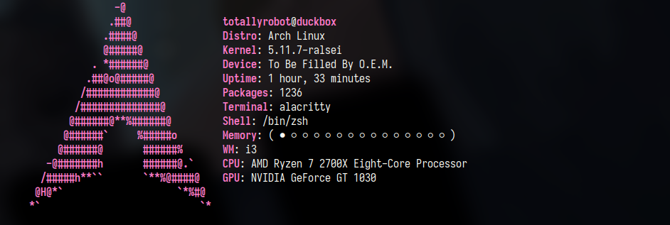

# hyperfetch - a fast system information tool

hyperfetch is a system information fetcher that focuses on being fast while still looking nice.

## Features
- Mutlithreaded information gathering
- A config file

## Shell support
✓ means fully working

x means not working

\- means mostly working but some features dont work

- KornShell (ksh) - ✓
- GNU Bourne Again Shell (bash) - ✓
- Z Shell (zsh) - ✓
- Busybox ash (busybox sh) - -
- Debian Almquist shell (dash) - ✓

# Operating Support
✓ means fully working

x means not working

\- means mostly working but some features dont work

- Linux (Arch, Gentoo) - ✓
- macOS - -
- Linux (Other Distros) - -

## credit
neofetch - most of the ascii art 
